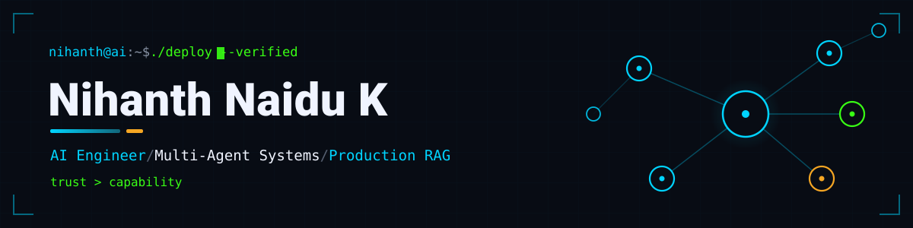
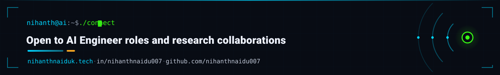

<!--
  Nihanth Naidu Kalisetti — GitHub profile README
  Palette matches the live portfolio (nihanthnaiduk.tech):
    cyan #00d4ff · neon-green #39ff14 · bg #080c14
  Banners in /assets are bespoke SVGs (Syne + DM Mono, text as vector paths).
-->

<div align="center">



<br/>

<a href="https://www.nihanthnaiduk.tech/">
  
</a>
<a href="https://linkedin.com/in/nihanthnaidu007">
  
</a>
<a href="https://huggingface.co/nihanthnaidu007">
  
</a>
<a href="mailto:nihanthnaidu.kalisetti@my.liu.edu">
  
</a>
<br/>


<br/><br/>

<a href="https://git.io/typing-svg">
  
</a>

</div>

---

## About

<table>
<tr>
<td width="62%" valign="top">

I am an AI Engineer with 4+ years in machine learning and 1.5+ years shipping production GenAI systems. The work I care about is the kind that collapses a multi-day workflow into minutes and produces a measurable cost or efficiency gain, not a demo that looks good once and breaks under load.

My focus is the full stack of applied AI: multi-agent orchestration with LangGraph, production RAG, LLM evaluation and observability, and the MLOps to keep it running.

The principle under everything I build is **trust over capability**. A system that refuses or flags its own uncertainty is worth more than one that answers confidently and is sometimes wrong. That principle is visible in every project below, from a SQL agent that refuses out-of-scope questions to a code-optimization engine where no language model is permitted anywhere in the scoring path.

Currently completing an MS in Artificial Intelligence at Long Island University Brooklyn while building open source in public.

</td>
<td width="38%" valign="top">

```yaml
name:     Nihanth Naidu Kalisetti
role:     AI Engineer
based:    Brooklyn, New York
studying: MS Artificial Intelligence
          LIU Brooklyn (Dec 2026)

builds:
  - multi-agent orchestration
  - production RAG pipelines
  - LLM evaluation + tracing
  - MLOps + inference infra

principle: trust over capability
shipped:   2 PyPI packages
writing:   LinkedIn Top AI Voice
status:    open to AI roles
```

</td>
</tr>
</table>

---

## Flagship systems

Open source. Each ships with a fixed benchmark and documents its own failure modes on purpose, because hiding them would defeat the point.

### ⬡ &nbsp; NIXUS SQL &nbsp; — &nbsp; Grounded Text-to-SQL Agent

   

> `LangGraph` · `PostgreSQL` · `pgvector` · `FastAPI` · `Next.js` · `Claude` · `OpenAI`

A read-only, database-agnostic natural-language to SQL agent. It is read-only by construction, not by convention: the database is reached only through a PostgreSQL role granted nothing but `SELECT`, so a write is rejected twice, once by the API guard and definitively by the role itself. There is no write mode. A 14-node graph classifies scope and refuses out-of-scope, write, and irreducibly ambiguous requests up front, retrieves schema and few-shot examples through pgvector, verifies that generated SQL references only tables and columns that exist before execution, and self-corrects failed queries under a bounded retry.

| Benchmark (held-out SaaS gold set, result-equivalence) | Result |
|---|---|
| Answerable queries | **55 / 57** &nbsp;(easy 13/13 · medium 15/17 · hard 27/27) |
| Scope refusals | **10 / 10** |

Two failures are left unfixed and documented: a faithfulness gap where a well-formed grounded query can quietly narrow the request, and a `DISTINCT` omission on some queries. Both are architectural boundaries, stated plainly rather than papered over.

<br/>

### ⬡ &nbsp; AXIOM &nbsp; — &nbsp; Adaptive RAG Pipeline

   

> `LangGraph` · `pgvector` · `BM25` · `Redis` · `FastAPI` · `Claude Haiku` · `Tavily`

A 13-node cyclic pipeline with a self-correcting hallucination loop. Every answer is scored on faithfulness, relevancy, and groundedness. If faithfulness drops below 0.75, the query is rewritten and retrieval runs again, up to three times. The pipeline routes across three retrieval strategies (BM25, pgvector, and RRF hybrid fusion) by query type, reranks candidates with a cross-encoder before generation, and falls back to live web search when the corpus returns nothing, rather than burning correction cycles on a futile loop. A two-tier Redis semantic cache serves sub-3-second responses on hits versus 30 to 90 seconds for a full run.

| Benchmark (30-query suite) | Result |
|---|---|
| Completion rate | **100%** (30/30) |
| Correction success rate | **100%** |
| Avg composite RAGAS | 0.532 &nbsp;(0.91 on in-corpus category) |
| Latency vs prior evaluator | **~55% lower**, all timeouts eliminated |

<br/>

### ⬡ &nbsp; Darwin &nbsp; — &nbsp; Verified Code-Optimization Engine

   

> `Python` · `Docker` · `radon` · `vulture` · `ast` · `Claude Opus`

Darwin takes one working-but-bloated Python unit, has a language model simplify it, then objectively verifies the result is correct, behavior-preserving, and structurally simpler, or returns the original unchanged. The point of the project is the verification, not the rewrite. **No language model judges correctness or quality anywhere in the scoring path.** A candidate must pass a correctness gate (pytest inside a locked-down container), a behavior gate (exact reproduction of withheld golden input-output pairs, or differential equivalence at the public API), and only then receives a structural complexity score computed by radon, vulture, and ast.

Two guarantees define it. It is **never worse than baseline**: the loop returns the best gate-passing candidate or the unmodified original. And it is **access-isolated**: every candidate runs with no network, no host filesystem, and capped memory, CPU, and PID as a non-root user. One residual is documented honestly rather than hidden: in-process verdict forgery stays open by deliberate decision, deferred to a future process split. Darwin is an access-safe verifier, not a forgery-proof judge, and it does not claim otherwise. Validated on a 30-case single-function corpus plus 3 multi-file cases, 150 runs, 95.3% reaching the returned-best candidate in generation one.

<br/>

### ⬡ &nbsp; ResearchForge &nbsp; — &nbsp; Hierarchical Multi-Agent Research System

  

> `LangGraph` · `GPT-4o` · `Tavily` · `FastAPI` · `React 19` · `PostgreSQL` · `ReportLab`

Six specialized agents orchestrated by a deterministic supervisor. No language model is involved in any routing decision; the supervisor routes purely on explicit state-inspection rules.

- **Parallel fact-checking** through the LangGraph `Send()` API fans out all claim verifications simultaneously, bringing verification time to roughly three seconds regardless of claim count.
- **Human-in-the-loop** outline approval via `interrupt()` with PostgresSaver checkpointing pauses the graph mid-run and resumes from the exact node without re-running completed phases.
- **Report versioning** diffs the original outline against the approved one and skips synthesis for unchanged sections, saving around 80% of tokens when only part of a report changes.

---

## Published packages

<table>
<tr>
<td width="50%" valign="top">

### ⬢ &nbsp; inputguard

<a href="https://pypi.org/project/inputguard/"></a> 

```bash
pip install inputguard
```

A pre-flight input-clarity layer that sits between user input and an LLM call. It detects vague, incomplete, or underspecified inputs before they reach the model, removing the correction cycle that wastes tokens when the model guesses wrong.

Zero LLM calls. Zero external dependencies. Pure local Python (3.9+). Ships with `warning` and `strict` modes and automatic intent detection.

</td>
<td width="50%" valign="top">

### ⬢ &nbsp; ai-stamp

<a href="https://pypi.org/project/ai-stamp/"></a> 

```bash
pip install ai-stamp
```

Provenance tracking, audit trails, and PII detection for AI-generated content. Every LLM call is stamped with a tamper-evident record: SHA256 hashes, an HMAC-SHA256 signature, token counts, latency, PII scan results, and policy decisions.

Six built-in PII detectors with Luhn validation, a declarative YAML policy engine, SQLite and PostgreSQL backends, and a full CLI. Python 3.10+, MIT.

</td>
</tr>
</table>

---

## More builds

**SpectraVoice** — a hands-free, screen-aware voice assistant for macOS that sees the screen in real time, controls keyboard and mouse, searches the web, and responds with natural text-to-speech. Supports both cloud and local Ollama inference with barge-in interruption. `Python` · `Whisper` · `Ollama` · `FastAPI`

<sub>More projects, including live demos, are pinned below and on the <a href="https://www.nihanthnaiduk.tech/">portfolio</a>.</sub>

---

## Stack

<div align="center">

**AI · GenAI · Agents**


**MLOps · Infrastructure**


**Data · Vector Search · ML**


**Languages**


</div>

---

## Experience

**AI/ML Engineer, Contract** &nbsp;·&nbsp; Nutraceutical Company (Confidential), New York &nbsp;·&nbsp; `Dec 2025 – Mar 2026`
Architected a multi-agent LangGraph pipeline that collapsed CFA generation from 7 days to 20 minutes, reducing dependency on 5+ domain experts. Deployed a Claude-powered compliance reviewer that cut regulatory label validation from 2 days to 2 minutes per SKU. Built a hybrid BM25/pgvector enterprise search over internal documentation, and automated end-to-end marketing asset production via n8n, collapsing a 6-week cross-team process to 15 minutes from a single brief.

**Founding AI/ML Engineer, Contract** &nbsp;·&nbsp; UnityGrid AI &nbsp;·&nbsp; `Jul 2024 – Jan 2025`
Designed multi-agent LangChain workflows for semiconductor design validation, cutting manual review time by 36% across 3 engineering teams. Engineered a pgvector and Redis RAG system that brought p95 latency under 900ms and lowered infrastructure cost by 28%. Established LangSmith observability with continuous hallucination tracking, shifting regression detection from post-deployment to pre-release.

**AI/ML Engineer, promoted from ML Engineer** &nbsp;·&nbsp; Futzen eTechnologies &nbsp;·&nbsp; `Apr 2021 – Jun 2024`
Promoted to AI Engineer within 2 years. Built customer segmentation and behavior models with K-Means, decision trees, and collaborative filtering, deployed across live production pipelines. Streamlined feature-engineering pipelines, cutting model training prep time by 35% and lifting F1 across production deployments.

---

## Education & recognition

<table>
<tr>
<td width="50%" valign="top">

**Education**

🎓 &nbsp;**MS, Artificial Intelligence**
Long Island University Brooklyn &nbsp;·&nbsp; `Jan 2025 – Dec 2026`

🎓 &nbsp;**B.Tech, Computer Science**
Centurion University, India &nbsp;·&nbsp; `2020 – 2024`

</td>
<td width="50%" valign="top">

**Recognition & certifications**

🏆 &nbsp;LinkedIn **Top AI Voice**
☁️ &nbsp;AWS Certified AI Practitioner
🤖 &nbsp;IBM AI Developer Professional Certificate
🪟 &nbsp;Microsoft Certified: Azure Fundamentals
🐍 &nbsp;Google IT Automation with Python

</td>
</tr>
</table>

---

## GitHub

<div align="center">


<br/><br/>

<!--
  Snake animation. Generated by .github/workflows/snake.yml and served from the `output` branch.
  It renders as a broken image until that workflow has run at least once and created the branch.
  Green snake (#39FF14) eating a cyan contribution ramp (#00D4FF).
-->


</div>

---

<div align="center">



<a href="https://www.nihanthnaiduk.tech/">
  
</a>
<a href="https://linkedin.com/in/nihanthnaidu007">
  
</a>

</div>
